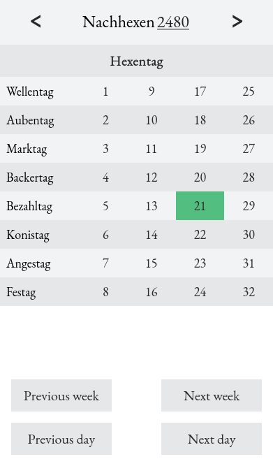

# Almanach

When playing the [Warhammer Fantasy Roleplay][wfrp4], _Almanach_ helps you keep track of the current date inside its world with ease. It is an implementation of the imperial calendar and can be an invaluable addition to a Game Master's toolbox.

[][almanach]

Just visit [this website][almanach] on your smartphone, and you're good to go.

Note: _Almanach_ doesn't store any of your personal data on any server. All state is held within the url of the page so you're able to save your current progress by just copying the url.

## Development Setup

```
$ yarn
$ yarn dev
```

## Credits

Thanks to [Chris][chrisprofile] for creating the amazing design that makes this little App so wonderful and slick.

[wfrp4]: https://www.cubicle7games.com/our-games/warhammer-fantasy-roleplay/
[almanach]: https://almanach.onrender.com/
[chrisprofile]: https://github.com/DuChrisNix
